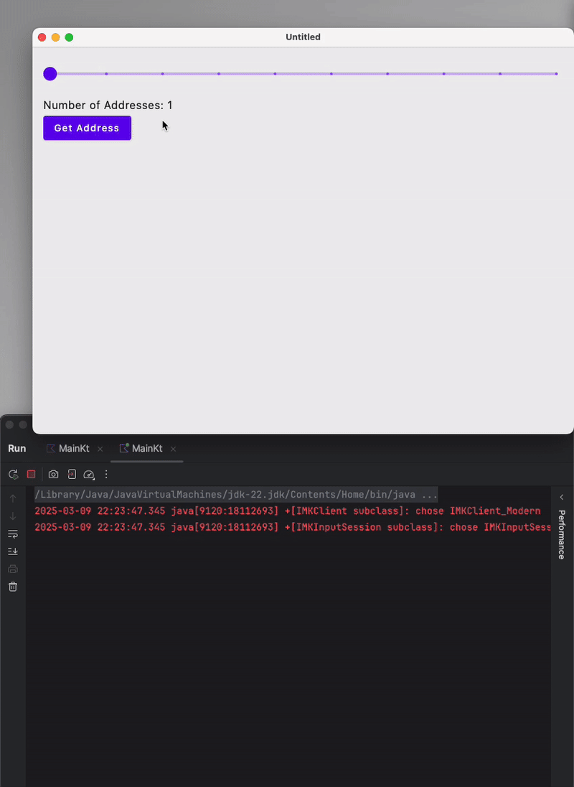

# Simple Kotlin Address Fetcher App with Jetpack Compose and Coroutines

This app uses minimal Jetpack Compose setup for the UI and uses Kotlin Coroutines to asynchronously make multiple GET calls, and dynamically update the UI as each data point arrives from the API.
I built this app to explore how asynchronous UI works with coroutines in a Compose-based app.

First a random list of addresses is chosen. Then we make multi-threaded GET calls to restcountries.com to extract population for each country and dynamically update our list with the new information.

The idea for this app, is from another [task](https://github.com/gavjan/my_task/) I did as a recruitment home assignment.

# Demo

